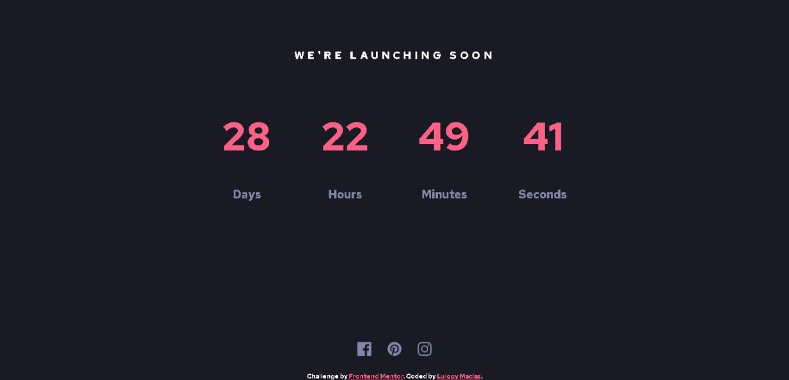

# Frontend Mentor - Launch countdown timer solution

This is a solution to the [Launch countdown timer challenge on Frontend Mentor](https://www.frontendmentor.io/challenges/launch-countdown-timer-N0XkGfyz-). Frontend Mentor challenges help you improve your coding skills by building realistic projects. 

## Table of contents

- [Overview](#overview)
  - [The challenge](#the-challenge)
  - [Screenshot](#screenshot)
  - [Links](#links)
- [My process](#my-process)
  - [Built with](#built-with)
  - [What I learned](#what-i-learned)
  - [Continued development](#continued-development)
  - [Useful resources](#useful-resources)

## Overview

### The challenge

Users should be able to:

- See hover states for all interactive elements on the page
- See a live countdown timer that ticks down every second
- **Bonus**: When a number changes, make the card flip from the middle

### Screenshot



### Links

- Live Site URL: [github page](https://macluiggy.github.io/launch-countdown-timer-main-FM/)

## My process

### Built with

- Semantic HTML5 markup
- CSS custom properties
- Flexbox
- CSS Grid
- Mobile-first workflow
- [Sass](https://sass-lang.com/) - CSS preprocessor

### What I learned

this is the first project i use a preprocessor like SASS, it's rally cool use it becouse it automatize some things that otherwise you must do with plain css. I learned things such as @mixins, @for, @each, variables. partials that are only implement in SASS and not in CSS.
For example, i used the @mixin method to make a border of an element depending in its arguments, this is the code:

```scss
@mixin border-stroke($val) {
    @if $val==light {
        border: solid 1px white;
    }

    @else if $val==medium {
        border: solid 3px white;
    }

    @else if $val==heavy {
        border: solid 6px white;
    }

    @else {
        border: none;
    }
}
```


### Continued development

I would like to still using sass, because it's very helpful and i need more practice with it...

### Useful resources
[w3school](https://www.w3schools.com/) and [stackoverflow](https://stackoverflow.com/) were of great help to solve some doubts.

## Author

- Frontend Mentor - [@macluiggy](https://www.frontendmentor.io/profile/macluiggy)
- LinkedIn - [Luiggy Macias](https://www.linkedin.com/in/luiggy-macias-402696155/)

